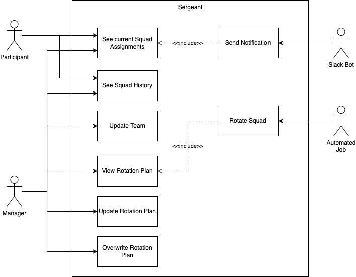

# Use Cases
## UML Diagram

## Actors
| name | description |
| - | - |
| Participant | A member of one or more squads. According to the Rotation Plan he will be assigned to a squad for a specified amount of time. |
| Manager | Responsible for maintaining the Rotation Plan |
| Slack Bot | A chatbot that acts as a blackboard for the Rotation Plan. It should regularly post a message to let the others know their assigned squad. |
| Automated job | Responsible for rotating the squad participants. |

## Use Cases
### UC01: See current Squad assignments
Priority: A

This is the most important functionality of this tool. Every participant should know which squad he/she is assigned to. Therefore he/she must have the opportunity to look this up in the sergeant.

### UC02: See Squad History
Priority: C

The history of all the previous squad assignments is a nice to have feature.

### UC03: Update Team
Priority: A

All the participants must be captured somewhere. A team is therefore the collection of all the participants that should rotate in and out of the squads.

### UC04: View Rotation Plan
Priority: A

It should be possible to view the current configuration for rotating the squad members. The configuration consists of a set of rules that describe how each menber rotates in and out of the squad.

### UC05: Update Rotation Plan
Priority: A

The rotation plan is the core functionality behind Sergeant. The manager should be able to perfectly adjust the plan to his needs.

### UC06: Overwrite Rotation Plan
Priority: A

Sometimes the manager needs to overwrite the rotation plan. This can either have an impact on the rules (eg. shift rotations) or simply replace an assignment temprarily. An example would be that a participant called in sick, but the squad needs the exact amount of members. It can be seen as a sub use case of UC05.

### UC07: Send Notification
Priority: B

To make it easier for Managers to communicate the current Squad assignments it should be possible to send notifications via a Chatbot.

### UC08: Rotate Squad
Priority: A

This is also part of the core functionality. In this step the Participants should be distributed to the squads according to the Rotation Plan. This affects the current Squad assignments. A automated job should be able to do this. 

## Legend
### Priorities
The use cases are prioritized into 3 buckets:

* **A**: Must have - without this feature the tool is incomplete and can't be released/used
* **B**: Next Step - can be tacked as soon as the first version is in use.
* **C**: Nice to haves - don't have to be developed necessarily.
